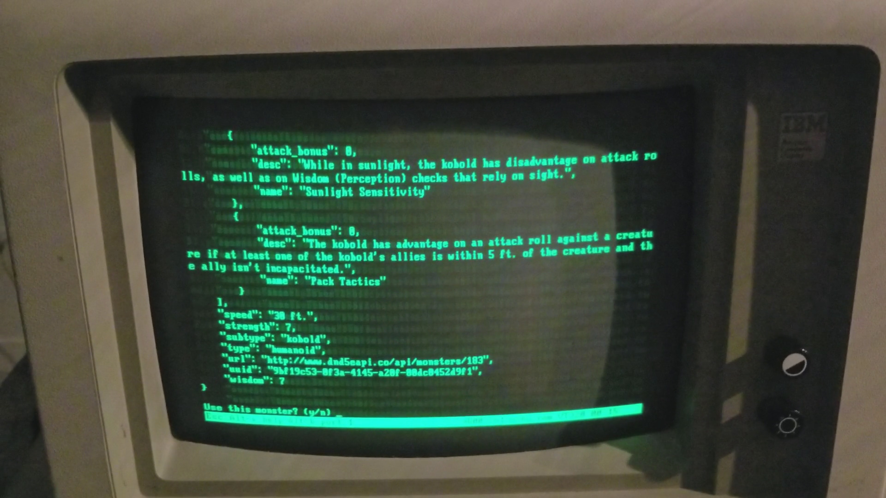

# Console DND Campaign Helper

This is a series of Python scripts I wrote to organize a DND campaign and look cool doing it on an original IBM PC

## Features

Run a campaign that is broken up into areas, each of which can have battles. Add participants to battles, including PCs and NPCs. Uses data from the DND 5E to provide you all of the monsters' information and stats.

## Demo

### Screenshot

### Video

Here it is running in cool-retro-term

[demo.webm](./img/demo.webm)

